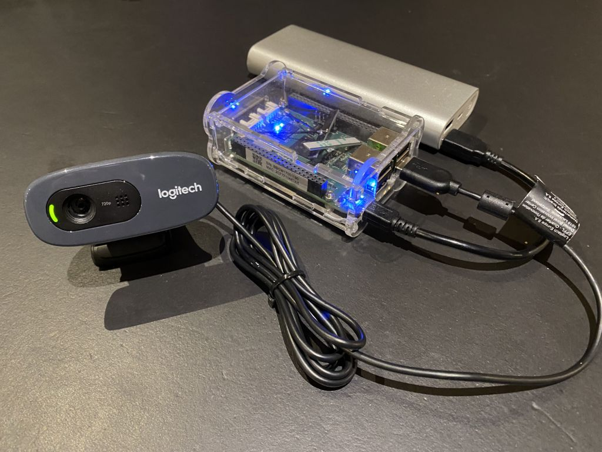

# Trap camera



This camera is made from a web camera connected to a single board computer. The single board computer runs code that will upload video clips when it detects movement or a certain feature in the frame. 

## Setting up the BeagleBone Green

I have a couple of BeagleBone Greens that I bought for another project. So that is what I will be using. Another single board computer like the Raspberry PI will probably work fine too. There is some BB specific code in start.sh to turn off the blue leds on the BB, but that is it. The main program trapcam.py will run fine on a PC with a connected webcam.

First connect BBG to PC via USB. SSH to BBG as debian@192.168.7.2 default password is *temppwd*.

### Configure wireless

```
$ sudo connmanctl
connmanctl> enable wifi
connmanctl> scan wifi
connmanctl> services
connmanctl> agent on
connmanctl> connect wifi_884aea627540_4e69656c73656e34_managed_psk
connmanctl> services
```
Confirm there is a *AO or *AR next to the Nexwork ID

Reference: https://www.fis.gatech.edu/how-to-configure-bbw-wifi/

### Install OpenCV

Install OpenCV for Python 3 using 
```
$ sudo apt update && sudo apt install python3-opencv
``` 
(this will take a while)

### Set timezone

The current time will be printed on the video, so we will want to see the correct timezone.

Check current timezone 
```
$ timedatectl
```

List available timezones 
```
$ timedatectl list-timezones
```

Set timezone 
```
$ sudo timedatectl set-timezone Australia/Brisbane
```


### Clone the project from GitHub

Clone the repository
```
$ git clone https://github.com/nielsenamrose/trap-camera.git
```

### Run start.sh when the device starts

Make start.sh executable
```
$ chmod +x trap-camera/start.sh
```

Edit crontab
```
$ sudo crontab -e
```

Add the line
```
@reboot cd /home/debian/trap-camera && ./start.sh &
```

## The development environment

This section is by no means complete. There are many options for doing Python development. Here are just a few random notes I found useful when using Anaconda on Ubuntu.

To install OpenCV using conda: `conda install -c conda-forge opencv`

To reset camera: `sudo modprobe -r uvcvideo && sudo modprobe uvcvideo`
